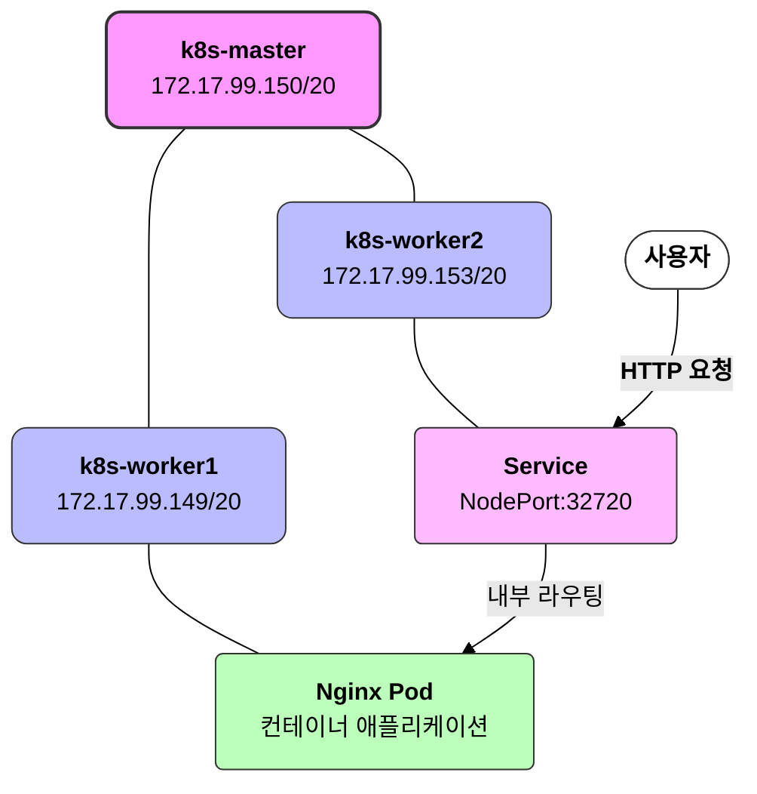

## 쿠버네티스 클러스터 구성 및 Nginx 배포 과정


이번 클라우드 수업 4주차 과제로 쿠버네티스 클러스터를 구성하고 Nginx를 배포하는 작업을 진행했습니다. Ubuntu 22.04 환경에서 Kubernetes v1.29 버전을 사용하여 구성했으며, 여러 문제에 직면했지만 성공적으로 해결했던 과정을 공유합니다.

## 환경 구성

### 시스템 환경
- **운영체제**: Ubuntu 22.04 LTS (모든 노드)
- **쿠버네티스 버전**: v1.29.15
- **컨테이너 런타임**: Docker CE + containerd
- **네트워크 플러그인**: Flannel

### VM 사양
- **CPU**: 2 코어
- **메모리**: 4GB
- **디스크**: 50GB
- **노드 수**: Master 1개, Worker 2개

### VM 설정
학교 환경에서 다음과 같이 VM을 구성했습니다:
- **Master 노드**: 172.17.99.150/20
- **Worker 노드 1**: 172.17.99.149/20
- **Worker 노드 2**: 172.17.99.153/20

집에서는 다음 IP로 구성했었습니다:
- **Master 노드**: 172.30.1.20/24
- **Worker 노드 1**: 172.30.1.61/24
- **Worker 노드 2**: 172.30.1.63/24

## 쿠버네티스 설치 및 클러스터 구성

### 사전 요구사항 설정 (모든 노드)

```bash
# 호스트 이름 설정
# Master 노드에서
sudo hostnamectl set-hostname k8s-master
# Worker1 노드에서
sudo hostnamectl set-hostname k8s-worker1
# Worker2 노드에서
sudo hostnamectl set-hostname k8s-worker2

# 시스템 업데이트
sudo apt update && sudo apt upgrade -y

# 필요한 패키지 설치
sudo apt install -y apt-transport-https ca-certificates curl software-properties-common

# 스왑 비활성화
sudo swapoff -a
sudo sed -i '/ swap / s/^\(.*\)$/#\1/g' /etc/fstab

# 방화벽 설정
sudo ufw allow 6443/tcp  # Kubernetes API 서버
sudo ufw allow 2379:2380/tcp  # etcd
sudo ufw allow 10250/tcp  # Kubelet API
sudo ufw allow 10251/tcp  # kube-scheduler
sudo ufw allow 10252/tcp  # kube-controller-manager
sudo ufw allow 8285/udp  # Flannel VXLAN
sudo ufw allow 8472/udp  # Flannel VXLAN
```

### Docker 설치 (모든 노드)

```bash
# Docker 설치
curl -fsSL https://get.docker.com | sudo sh

# Docker 시작 및 활성화
sudo systemctl start docker
sudo systemctl enable docker

# containerd 설정
sudo mkdir -p /etc/containerd
sudo containerd config default | sudo tee /etc/containerd/config.toml > /dev/null
sudo sed -i 's/SystemdCgroup = false/SystemdCgroup = true/g' /etc/containerd/config.toml
sudo systemctl restart containerd
```

### 쿠버네티스 설치 (모든 노드)

```bash
# 쿠버네티스 키 및 저장소 추가
curl -fsSL https://pkgs.k8s.io/core:/stable:/v1.29/deb/Release.key | sudo gpg --dearmor -o /etc/apt/keyrings/kubernetes-apt-keyring.gpg
echo 'deb [signed-by=/etc/apt/keyrings/kubernetes-apt-keyring.gpg] https://pkgs.k8s.io/core:/stable:/v1.29/deb/ /' | sudo tee /etc/apt/sources.list.d/kubernetes.list

# 쿠버네티스 패키지 설치
sudo apt update
sudo apt install -y kubelet kubeadm kubectl
sudo apt-mark hold kubelet kubeadm kubectl

# 버전 확인
kubectl version --client
kubeadm version
```

### Master 노드 설정

```bash
# 클러스터 초기화
sudo kubeadm init --pod-network-cidr=10.244.0.0/16 --apiserver-advertise-address=172.17.99.150

# kubectl 설정
mkdir -p $HOME/.kube
sudo cp -i /etc/kubernetes/admin.conf $HOME/.kube/config
sudo chown $(id -u):$(id -g) $HOME/.kube/config

# 초기화 결과 확인
kubectl get nodes
```

### 네트워크 구성 (Flannel)

```bash
# Master 노드에서 Flannel 설치
kubectl apply -f https://raw.githubusercontent.com/flannel-io/flannel/master/Documentation/kube-flannel.yml --validate=false

# 네트워크 상태 확인
kubectl get pods -n kube-system
```

## 노드 연결 문제 해결

### Worker 노드 설정
각 Worker 노드에서 다음 명령어 실행:

```bash
# Master 노드에서 생성된 join 명령어 실행
sudo kubeadm join 172.17.99.150:6443 --token nmml6m.c78iz2weqz6i11yw \
        --discovery-token-ca-cert-hash sha256:805b02c820939f65aa50e86654ee50b52218b71bc5601e054530a3395a75bd1d
```

### Join 토큰 만료 시 새 토큰 생성 방법
```bash
# Master 노드에서 새 토큰 생성
kubeadm token create --print-join-command
```

### Worker 노드가 NotReady 상태일 때 해결 방법

Worker 노드에서 CNI 문제를 해결하기 위한 설정:

```bash
# 기존 CNI 설정 삭제
sudo rm -rf /etc/cni/net.d/*
sudo rm -rf /var/lib/cni/

# CNI 디렉토리 생성
sudo mkdir -p /opt/cni/bin
sudo mkdir -p /etc/cni/net.d

# Flannel 설정 파일 생성
cat <<EOF | sudo tee /etc/cni/net.d/10-flannel.conf
{
  "name": "cbr0",
  "type": "flannel",
  "delegate": {
    "isDefaultGateway": true
  }
}
EOF

# 네트워크 설정
sudo sysctl -w net.ipv4.ip_forward=1
sudo modprobe br_netfilter
sudo sysctl -w net.bridge.bridge-nf-call-iptables=1

# 서비스 재시작
sudo systemctl restart containerd
sudo systemctl restart kubelet
```

## Nginx 배포 및 테스트

### 마스터 노드에서 스케줄링 허용

```bash
# 마스터 노드에서도 파드 실행 허용
kubectl taint nodes --all node-role.kubernetes.io/control-plane-
```

### Nginx 배포

```bash
# Nginx 배포 생성
kubectl create deployment nginx --image=nginx --replicas=1

# YAML 형식으로 배포 설정 파일 생성
kubectl create deployment nginx --image=nginx --replicas=1 --dry-run=client -o yaml > nginx-deployment.yaml

# 배포 확인
kubectl get deployments
kubectl get pods
```

### 서비스 노출

```bash
# NodePort로 서비스 노출
kubectl expose deployment nginx --type=NodePort --port=80

# YAML 형식으로 서비스 설정 파일 생성
kubectl expose deployment nginx --type=NodePort --port=80 --dry-run=client -o yaml > nginx-service.yaml

# 서비스 확인
kubectl get services
```

### 포드 상세 정보 확인

```bash
# 포드 세부 정보 확인
kubectl describe pod nginx-<pod-id>

# 로그 확인
kubectl logs nginx-<pod-id>
```

결과적으로:
- NodePort `32720`으로 Nginx 서비스가 노출되었습니다.
- `http://172.17.99.150:32720`로 접속하여 Nginx 웹페이지를 확인했습니다.

## 문제 해결 과정

1. **쿠버네티스 저장소 키 오류**: GPG 키를 직접 다운로드하여 해결했습니다.
   ```bash
   # 이전 방식이 실패할 경우 직접 다운로드
   curl -fsSL https://pkgs.k8s.io/core:/stable:/v1.29/deb/Release.key | sudo gpg --dearmor -o /etc/apt/keyrings/kubernetes-apt-keyring.gpg
   ```

2. **CNI 초기화 오류**: Worker 노드에서 Flannel 설정 파일을 수동으로 생성하여 해결했습니다.
   ```bash
   # /etc/cni/net.d/ 디렉토리 클리닝
   sudo rm -rf /etc/cni/net.d/*
   sudo mkdir -p /etc/cni/net.d
   
   # Flannel 설정 생성
   cat <<EOF | sudo tee /etc/cni/net.d/10-flannel.conf
   {
     "name": "cbr0",
     "type": "flannel",
     "delegate": {
       "isDefaultGateway": true
     }
   }
   EOF
   ```

3. **Worker 노드 NotReady 상태**: 네트워크 설정과 kubelet 재시작으로 해결했습니다.
   ```bash
   # 네트워크 설정
   sudo sysctl -w net.ipv4.ip_forward=1
   sudo modprobe br_netfilter
   sudo sysctl -w net.bridge.bridge-nf-call-iptables=1
   
   # 서비스 재시작
   sudo systemctl restart containerd
   sudo systemctl restart kubelet
   ```

4. **포드 시작 오류**: 이벤트 로그 확인을 통해 분석했습니다.
   ```bash
   kubectl describe pod <pod-name>
   ```

## 성공 확인

클러스터 노드 상태:
```
NAME         STATUS   ROLES           AGE    VERSION
k8s-master   Ready    control-plane   20m    v1.29.15
k8s-worker1  Ready    <none>          15m    v1.29.15
k8s-worker2  Ready    <none>          15m    v1.29.15
```

배포 및 서비스 상태:
```
NAME    TYPE       CLUSTER-IP      EXTERNAL-IP   PORT(S)        AGE
nginx   NodePort   10.104.44.125   <none>        80:32720/TCP   15m
```

모든 노드가 Ready 상태로 변경되고, Nginx 서비스도 정상 작동하여 과제를 성공적으로 완료했습니다!

## 이미지 추가 설명

클러스터 구조 다이어그램:



Nginx 웹페이지 접속 결과:


## 과제 완료 항목

- [x] VM 생성하기 (2코어/4GB/50GB 사양으로 3개)
- [x] 쿠버네티스 클러스터 구성하기
  - [x] Master 노드 1개 설정
  - [x] Worker 노드 2개 설정
  - [x] 클러스터 연결 확인
- [x] Nginx 컨테이너 배포하기
  - [x] 배포 설정 작성
  - [x] 컨테이너 실행 확인
  - [x] 접속 테스트