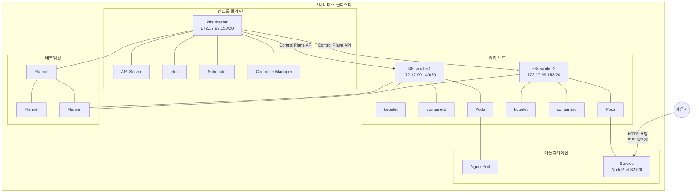

```mermaid
graph TB
    subgraph "쿠버네티스 클러스터"
        M[k8s-master<br/>172.17.99.150/20] -- "Control Plane API" --> W1[k8s-worker1<br/>172.17.99.149/20]
        M -- "Control Plane API" --> W2[k8s-worker2<br/>172.17.99.153/20]
        
        subgraph "컨트롤 플레인"
            M --- API[API Server]
            M --- ETCD[etcd]
            M --- SCH[Scheduler]
            M --- CM[Controller Manager]
        end
        
        subgraph "워커 노드"
            W1 --- K1[kubelet]
            W1 --- CR1[containerd]
            W1 --- P1[Pods]
            
            W2 --- K2[kubelet]
            W2 --- CR2[containerd]
            W2 --- P2[Pods]
        end
        
        subgraph "네트워킹"
            M --- FLM[Flannel]
            W1 --- FLW1[Flannel]
            W2 --- FLW2[Flannel]
            
            FLM --- FLW1
            FLM --- FLW2
        end
        
        subgraph "애플리케이션"
            P1 --- NGINX[Nginx Pod]
            P2 --- SVC[Service<br/>NodePort:32720]
        end
    end
    
    USER((사용자)) -- "HTTP 요청<br/>포트 32720" --> SVC
``` 